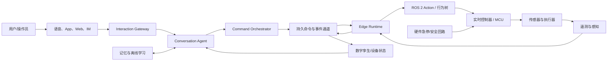
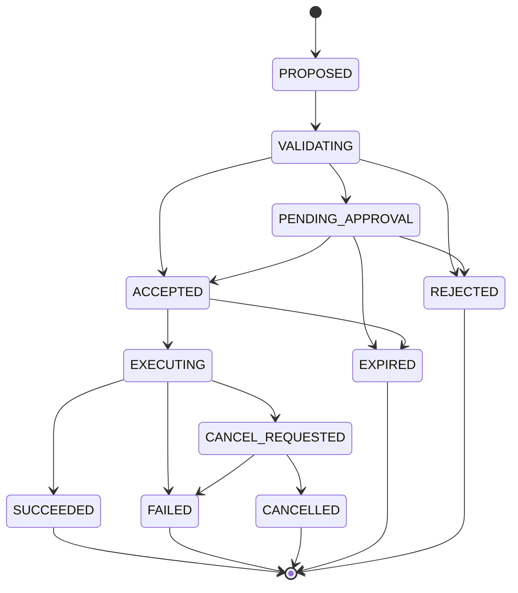
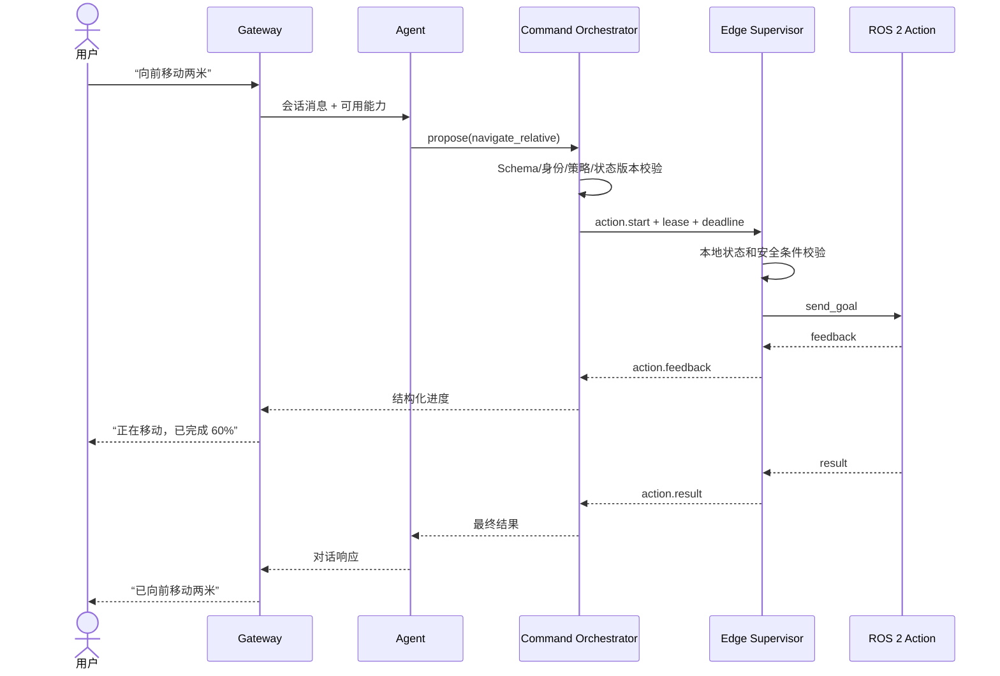
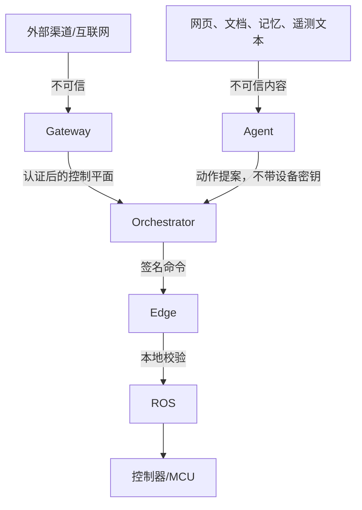

# 智能设备与机器人对话执行系统架构设计

## 1. 文档信息

| 项目 | 内容 |
| --- | --- |
| 文档状态 | Draft / 可进入技术预研 |
| 版本 | 0.1 |
| 日期 | 2026-07-30 |
| 适用范围 | 智能设备、移动机器人、服务机器人及其对话、任务规划和设备控制平台 |
| 研究基线 | OpenClaw、Claude Code、Hermes Agent、ROS 2、Matter、Home Assistant |
| 配套计划 | [开发计划](./development-plan.md) |

## 2. 执行摘要

### 2.1 可行性结论

方案技术上可行，但成立的前提是将 LLM Agent 与物理执行系统严格解耦。

推荐采用“慢速认知环 + 快速确定性控制环”的分层架构：

- OpenClaw 负责北向 Gateway、渠道、身份、会话、节点配对和能力目录。
- Claude Code 的设计思想用于 Agent 循环、类型化工具、权限判断、中断、并发控制和上下文压缩。
- Hermes Agent 的设计思想用于多模型适配、长期记忆、轨迹和离线技能学习。
- 自研 Command Orchestrator、Edge Safety Supervisor 和机器人动作协议。
- ROS 2 Action、行为树、实时控制器和硬件保护负责最终执行。

如果不增加独立的命令编排与安全执行层，直接让 OpenClaw、Claude Code 或 Hermes 调用机器人执行器，则方案不具备生产可行性。

### 2.2 总体判断

| 维度 | 结论 | 说明 |
| --- | --- | --- |
| 技术可行性 | 高 | Gateway、Agent、ROS 2、设备协议等基础组件均已成熟 |
| 集成复杂度 | 中高 | 主要复杂度来自动作语义、状态一致性、断网恢复和权限模型 |
| 原型开发可行性 | 高 | 可先在仿真器中完成端到端闭环 |
| 生产安全可行性 | 有条件可行 | 必须完成独立安全监督、风险分析和硬件保护 |
| 多设备扩展性 | 中高 | 需要在第二阶段引入持久消息总线、设备租约和 Gateway 高可用 |
| 代码复用可行性 | 中 | OpenClaw/Hermes 为 MIT；Claude Code 非官方源码不可复用 |
| 长期维护风险 | 中 | 应通过窄接口集成，避免形成 OpenClaw/Hermes 的大规模长期 fork |

## 3. 目标与非目标

### 3.1 目标

- 支持语音、App、Web、IM 等多渠道对话。
- 将自然语言转化为可验证、可审计、可取消的设备动作。
- 支持智能家居设备、移动机器人和服务机器人。
- 支持机器人断网后的安全降级。
- 支持任务状态查询、进度反馈、取消和人工接管。
- 支持多模型切换，但保证单次物理任务行为稳定。
- 支持长期记忆和离线技能改进。
- 为每一次物理动作提供完整审计链。

### 3.2 非目标

- 不允许 LLM 直接发送 PWM、关节力矩或原始电机速度。
- 不使用云端 Gateway 或 LLM 承担毫秒级闭环控制。
- 第一阶段不构建通用机器人操作系统。
- 第一阶段不实现在线自主技能修改。
- 第一阶段不追求多区域、多租户和大规模微服务部署。
- 不把聊天记录或语义记忆作为设备权威状态。

## 4. 核心约束与架构原则

### 4.1 安全不变量

以下约束必须在实现和测试中作为不可绕过的不变量：

1. LLM 只能提出目标或候选动作，不能直接控制执行器。
2. 所有写操作必须经过 Command Orchestrator 和 Edge Safety Supervisor。
3. 硬件急停、碰撞保护和看门狗不依赖 LLM、Gateway 或互联网。
4. 任何命令在身份、状态、策略或租约不明确时必须 fail-closed。
5. 每台设备同一控制域内只能有一个有效命令所有者。
6. 重试不能导致物理动作重复执行。
7. 过期命令、旧连接命令和旧主节点命令不能执行。
8. 模型回退不能改变正在执行中的物理任务。
9. 学习产生的技能必须经过离线验证、审批、签名和版本化。
10. 设备遥测、网页内容和外部消息均视为不可信输入。

### 4.2 工程原则

- KISS：第一阶段采用模块化单体 Gateway，加独立 Edge Runtime，不提前拆分大量微服务。
- YAGNI：MVP 不引入自动学习、多区域部署和复杂工作流平台。
- SOLID：对话、规划、命令、策略、执行、记忆分别定义边界。
- DRY：所有设备动作统一使用 Capability Manifest 和 Action Envelope。
- 安全优先：人工 approval 只代表授权，不代表动作安全。
- 状态优先：设备当前状态来自设备或数字孪生，不来自模型推测。
- 可恢复优先：所有跨网络操作采用幂等、期限、租约和状态版本。

## 5. 系统上下文



### 5.1 双环模型

| 环路 | 典型延迟 | 负责内容 | 禁止内容 |
| --- | --- | --- | --- |
| 认知慢环 | 数百毫秒到数秒 | 对话、意图识别、任务规划、说明和确认 | 电机闭环、碰撞保护、硬件急停 |
| 确定性快环 | 毫秒级或设备要求的周期 | 轨迹跟踪、传感器融合、安全限制、执行器控制 | 调用远程 LLM、阻塞数据库访问 |

## 6. 分层架构

### 6.1 Layer 0：硬件与实时安全

职责：

- MCU、RTOS、电机驱动、IO 和传感器采样。
- 硬件急停、限位、过流、过温和失控保护。
- 最低层速度、位置或力矩控制。
- 在上位机失联时进入预定义安全状态。

约束：

- 不依赖网络、数据库或 LLM。
- 不解析自然语言。
- 所有控制周期、超时和安全状态由设备风险分析确定。

### 6.2 Layer 1：设备抽象与 ROS 2

职责：

- HAL、`ros2_control` 硬件接口和设备驱动。
- ROS 2 Topic、Service、Action 和 Lifecycle Node。
- 将具体硬件转换为稳定、版本化的领域能力。
- 输出结构化状态、故障码和健康信息。

设计要求：

- Topic 用于连续传感器和状态流。
- Service 用于短时、无长生命周期的查询或配置。
- Action 用于导航、抓取、充电、扫描等可反馈、可取消任务。
- 低层执行器不得直接暴露给 LLM。

### 6.3 Layer 2：Edge Runtime 与安全监督

每台机器人或关键设备部署一个 Edge Runtime。

职责：

- 验证命令签名、租约、期限、状态版本和前置条件。
- 执行动作仲裁，确保同一控制域单写。
- 将平台动作映射为 ROS 2 Action 或本地状态机。
- 处理 cancel、abort、超时和 Gateway 断连。
- 本地记录动作账本和幂等结果。
- 上报结构化状态、进度、故障和安全事件。
- 可选提供本地 ASR/TTS 或离线规则引擎。

不负责：

- 通用自然语言规划。
- 在线技能生成。
- 依赖 SQLite 的实时控制。

建议进程边界：

```text
edge-agent
  ├── command-client
  ├── capability-registry
  ├── action-inbox
  ├── safety-supervisor
  ├── ros2-bridge
  ├── action-journal
  └── telemetry-publisher

实时控制器是独立进程或 MCU 固件，不嵌入 edge-agent。
```

### 6.4 Layer 3：控制平面与 Gateway

职责：

- 多渠道接入和会话路由。
- 用户、设备和服务身份认证。
- 设备配对、节点目录和能力目录。
- Agent 请求路由和流式响应。
- Command Orchestrator、审批和策略管理。
- 审计、限流、密钥引用和网络边界。
- 设备在线状态与数字孪生投影。

OpenClaw 可复用的设计：

- Gateway 与 Node 角色分离。
- 版本化、类型化协议。
- 节点配对、设备身份、能力声明。
- `idempotencyKey`、超时、取消、进度序号。
- 配对世代和连接路由校验。
- 渠道插件和 Agent 会话隔离。

必须新增：

- 持久 Action Ledger。
- `device.action.*` 机器人动作协议。
- 命令租约和 fencing token。
- 设备状态版本与前置条件。
- 风险分级和两阶段危险动作。
- Gateway 故障后的动作恢复和状态重建。

### 6.5 Layer 4：认知与对话

职责：

- 对话理解和响应。
- 从自然语言生成声明式目标。
- 查询设备能力与权威状态。
- 复杂任务分解和计划生成。
- 处理澄清、确认、拒绝和解释。
- 维护会话上下文和上下文压缩。
- 调用只读工具或向 Command Orchestrator 提交动作提案。

Claude Code 可借鉴的设计：

- 流式异步 Agent 循环。
- Tool Schema、输入校验和权限检查。
- `isReadOnly`、`isConcurrencySafe`、`isDestructive`。
- 只读工具并发，写工具串行。
- 取消和 turn interruption。
- 上下文压缩与工具结果配对。

限制：

- Agent 没有直接设备凭证。
- Agent 不能绕过 Command Orchestrator。
- 并行子 Agent 只能并行研究和规划，不能并行写同一设备控制域。
- 每次 Mission 固定模型、Prompt、Tool Schema 和策略版本。

边缘算力约束：

- 当 Agent Runtime 需要在算力受限的边缘设备上运行（离线或弱连接场景）时，上下文压缩不是可选优化而是硬约束。工具结果配对、上下文预算和主动压缩必须在此形态下同样成立。
- 边缘形态默认使用更小的模型和更短的上下文窗口；同一 Tool Schema 与动作提案协议在云端和边缘保持一致，只切换模型与预算参数，不改动作语义。

### 6.6 记忆与学习平面

采用独立平面，不进入物理动作关键路径。

数据分类：

| 数据 | 示例 | 是否权威 | 使用方式 |
| --- | --- | --- | --- |
| 会话记忆 | 用户偏好、称呼、语言 | 否 | 提升交互体验 |
| 任务轨迹 | 计划、动作、结果、异常 | 否 | 离线评估和技能候选 |
| 设备知识 | 手册、能力描述、维护文档 | 否 | 检索增强 |
| 设备状态 | 电量、位置、门锁状态 | 是 | 只能来自设备或数字孪生 |
| 安全策略 | 禁止区域、速度上限 | 是 | 由配置和策略服务管理 |
| 技能版本 | 已签名行为树或计划模板 | 条件权威 | 只加载已批准版本 |

Hermes 可借鉴：

- SQLite/FTS5 会话检索。
- 多模型 Provider 适配。
- 任务轨迹记录。
- Memory Provider 和 Context Engine 接口。
- 技能发现与加载模型。

不直接复用 Hermes 主循环和 Gateway 巨型模块；优先通过窄接口或独立服务集成。

## 7. 核心领域模型

### 7.1 Capability Manifest

每项高层设备能力对应一个版本化 Manifest，而不是直接对应硬件函数。

```yaml
capabilityId: robot.navigation.navigate_relative
version: 1.0.0
kind: action
description: 在本地坐标系内移动指定距离
safetyClass: S2_GUARDED
concurrencyKey: base_motion
interruptMode: abort
defaultTimeoutMs: 60000
offlinePolicy: execute_with_valid_lease
inputSchema:
  type: object
  required: [distanceM, maxSpeedMps]
  properties:
    distanceM:
      type: number
      minimum: -5
      maximum: 5
    maxSpeedMps:
      type: number
      minimum: 0.05
      maximum: 0.5
preconditions:
  - localization.healthy == true
  - safety.estop == false
  - battery.percent >= 15
resultSchema:
  type: object
  required: [distanceTravelledM, finalPose]
```

必填语义：

- `safetyClass`：决定是否允许自动执行、是否需要审批。
- `concurrencyKey`：同一资源域的动作互斥。
- `interruptMode`：`cancel`、`abort` 或 `non_interruptible`。
- `offlinePolicy`：断网后继续、停止或只允许本地控制。
- `preconditions`：由确定性策略解释器计算，不能由 LLM 自行判断。

### 7.2 安全等级

| 等级 | 含义 | 示例 | 默认策略 |
| --- | --- | --- | --- |
| S0_OBSERVE | 只读 | 查询电量、读取温度 | 自动允许 |
| S1_REVERSIBLE | 低影响、可逆 | 调节灯光、播放声音 | 策略允许时自动执行 |
| S2_GUARDED | 物理动作，需要环境约束 | 低速导航、机械臂抓取 | 安全监督器校验，按场景审批 |
| S3_HAZARDOUS | 高风险或不可逆 | 开门锁、高温设备、危险区域动作 | 人工审批加本地安全条件 |
| S4_FORBIDDEN | 禁止由 Agent 发起 | 关闭急停、绕过限位、写安全固件 | 永久拒绝 |

### 7.3 Action Envelope

```json
{
  "commandId": "cmd_01J...",
  "idempotencyKey": "conversation-turn:tool-call",
  "deviceId": "robot-001",
  "capabilityId": "robot.navigation.navigate_relative",
  "capabilityVersion": "1.0.0",
  "arguments": {
    "distanceM": 2,
    "maxSpeedMps": 0.3
  },
  "expectedStateVersion": 1842,
  "preconditions": [
    "localization.healthy == true",
    "safety.estop == false"
  ],
  "deadline": "2026-07-30T10:00:30Z",
  "priority": 50,
  "safetyClass": "S2_GUARDED",
  "leaseEpoch": 72,
  "actor": {
    "type": "user",
    "id": "user-123",
    "sessionId": "session-456"
  },
  "traceId": "trace-789",
  "modelSnapshot": {
    "provider": "provider-name",
    "model": "model-name",
    "promptHash": "sha256:...",
    "toolCatalogVersion": "2026-07-30.1",
    "policyVersion": "42"
  }
}
```

### 7.4 Action 状态机



终态不可变。晚到的重复结果只写入诊断事件，不得修改终态。

## 8. 核心交互流程

### 8.1 正常动作



### 8.2 取消、终止和急停

| 操作 | 发起者 | 通道 | 结果 |
| --- | --- | --- | --- |
| `cancel` | 用户或 Agent | Gateway → Orchestrator | 取消未开始动作 |
| `abort` | 用户、策略或 Edge | Orchestrator/Edge | 动作服务器执行安全终止 |
| `emergency_stop` | 人员、硬件或本地安全逻辑 | 独立硬件/本地链路 | 立即进入安全状态 |

对话 turn interruption 可以触发 `cancel` 或 `abort` 请求，但永远不能被定义为 `emergency_stop`。

### 8.3 断网处理

Edge Runtime 根据能力的 `offlinePolicy` 执行：

- `stop_on_disconnect`：Gateway 租约失效后安全终止。
- `complete_current_action`：允许完成当前已验证动作，不接受新动作。
- `execute_with_valid_lease`：在租约未过期时继续执行。
- `local_autonomy_only`：只允许本地控制器或本地操作员。

重连后：

1. Edge 上报连接身份、配对世代和本地 Action Ledger 水位。
2. Gateway 比对命令状态和 `leaseEpoch`。
3. 双方通过命令 ID 对账。
4. 已终态动作不重复执行。
5. 状态冲突进入人工或确定性恢复流程，不交给 LLM 自行决策。

## 9. 一致性与可靠性设计

### 9.1 传输语义

系统采用“至少一次传输 + 应用层恰好一次效果”：

- 所有命令携带稳定 `idempotencyKey`。
- Gateway 使用 Outbox 保证命令与状态写入一致。
- Edge 使用 Inbox/Action Journal 去重。
- 动作处理器必须幂等。
- 结果可重复投递，但终态不可覆盖。

### 9.2 租约与 fencing

- 每台设备或控制域有一个逻辑所有者。
- 每次所有权变化递增 `leaseEpoch`。
- Edge 只接受当前或更新的 epoch。
- 旧 Gateway、旧连接、网络分区中的旧命令全部拒绝。
- 租约过期行为由设备风险等级决定，不统一假设继续或停止。

### 9.3 状态版本

- 数字孪生包含单调递增 `stateVersion`。
- Agent 只读取带版本的状态快照。
- 动作携带 `expectedStateVersion`。
- Orchestrator 和 Edge 均检查状态是否仍满足前置条件。
- 对安全关键条件，Edge 必须读取本地实时状态重新判断。

### 9.4 数据持久化

MVP：

- Edge：SQLite WAL，保存 Action Inbox、Journal 和待同步事件。
- Gateway：SQLite，保存会话、设备目录、Action Ledger、Outbox 和审计。
- Agent：会话记录和非权威记忆。

规模化阶段：

- Gateway 状态迁移到 PostgreSQL 或等价事务数据库。
- 命令和事件使用 NATS JetStream 或等价持久消息系统。
- 遥测进入时序数据库或对象存储。
- 原始视频不进入 Agent 上下文，使用感知摘要或短期受控对象引用。

SQLite 只用于异步持久化，不进入实时控制线程。

## 10. 安全架构

### 10.1 信任边界



### 10.2 身份与授权

- 用户、Gateway、Agent Worker 和设备使用不同身份。
- 设备私钥存储在 TPM、Secure Element 或操作系统密钥库中。
- Agent 不持有设备控制密钥。
- Capability 授权基于设备、动作、用户角色、环境和时间范围。
- 密钥通过 SecretRef 引用，不进入 Prompt、日志或动作参数。
- 高风险动作采用短期、单用途 approval token。

### 10.3 Prompt Injection 防护

- 设备描述、网页、文档、OCR 和遥测文本均标记来源与信任等级。
- 模型输出必须通过 JSON Schema 和领域校验。
- 外部内容不能修改系统权限或安全策略。
- 工具结果中的指令性文本不获得更高优先级。
- 高风险能力不因模型声称“用户已批准”而跳过审批。

### 10.4 插件安全

- 北向渠道插件可运行在 Gateway 插件体系。
- 设备驱动和高风险适配器优先采用进程隔离。
- 插件 Manifest 只负责发现；运行时权限最小化。
- 插件和技能包需要来源、版本、哈希和签名。
- 禁止未经审核的插件在 Edge 获取任意 Shell 或设备节点权限。

### 10.5 安全工程要求

进入真实硬件测试前必须完成：

- 威胁建模。
- Hazard Analysis、FMEA 或 STPA。
- 每项 S2/S3 能力的安全条件定义。
- 断网、重复命令、乱序、超时和旧租约测试。
- 硬件急停、看门狗和人工接管验证。
- 目标行业适用法规和功能安全标准评估。

## 11. 可观测性

统一使用 OpenTelemetry 或等价标准传递 Trace Context。

### 11.1 关键关联 ID

- `traceId`
- `sessionId`
- `turnId`
- `commandId`
- `idempotencyKey`
- `deviceId`
- `leaseEpoch`
- `rosGoalId`
- `modelSnapshot`

### 11.2 核心指标

| 类别 | 指标 |
| --- | --- |
| 对话 | 首 Token 延迟、总响应时间、压缩次数、模型回退次数 |
| 命令 | 提案到接收延迟、拒绝率、重复投递率、超时率 |
| Edge | 当前租约、动作队列深度、ROS Action 延迟、断连次数 |
| 安全 | 前置条件拒绝、急停、看门狗触发、越界尝试 |
| 设备 | 在线率、电量、故障码、状态版本滞后 |
| 成本 | 每会话 Token、每任务模型调用、音视频处理量 |

安全事件和审计日志必须使用结构化事件，不依赖自由文本日志。

## 12. 部署架构

### 12.1 MVP

```text
单台服务器
  ├── OpenClaw Gateway
  ├── Agent Runtime
  ├── Command Orchestrator
  └── SQLite

单台机器人
  ├── Edge Runtime
  ├── SQLite Action Journal
  ├── ROS 2
  └── MCU/控制器
```

Gateway、Agent Runtime 和 Command Orchestrator 可以部署在同一主机，但保持模块和接口隔离。Edge Runtime 必须独立部署。

### 12.2 规模化

```text
Gateway Replicas
      │
Command Orchestrator
      │
PostgreSQL + Durable Bus
      │
Device Ownership / Lease Service
      │
Edge Runtime Fleet
```

每个设备控制域仍保持单写者，不能通过简单增加 Gateway 副本实现并行写控制。

## 13. 技术选型建议

| 子系统 | MVP 建议 | 规模化选项 | 说明 |
| --- | --- | --- | --- |
| 北向 Gateway | OpenClaw 插件/外部集成 | 窄 fork 或独立 Gateway | 先验证扩展点，避免过早 fork |
| Agent Runtime | TypeScript 异步 Agent 内核 | 独立 Worker 池 | Claude Code 只借鉴设计，不复用代码 |
| Command Orchestrator | TypeScript（与 Agent 同语言） | 独立服务，可换 Go/Rust | MVP 压到双语言，降低小团队集成成本 |
| Edge Runtime | Rust 优先，C++ 备选 | 同左 | 避免关键执行依赖 GC 停顿 |
| 机器人数据面 | ROS 2 DDS | ROS 2 + Zenoh 等跨域方案 | Gateway WS 不承载高频传感器流 |
| 本地状态 | SQLite WAL | 同左 | 不进入实时线程 |
| 中央状态 | SQLite | PostgreSQL | MVP 优先简单 |
| 持久消息 | 数据库 Outbox | NATS JetStream 等 | MVP 不提前引入 |
| 智能家居 | Home Assistant/Matter Adapter | 同左 | 写操作仍经过统一策略层 |
| 记忆检索 | SQLite FTS5 | 向量检索作为补充 | 权威设备状态不进入记忆 |
| 观测 | OpenTelemetry | 集中日志、指标和追踪 | 全链路统一 |

### 13.1 语言栈策略

MVP 阶段刻意压到两种语言，避免 6～8 人团队被三语言集成拖累：

- 慢环（Agent Runtime + Command Orchestrator）统一 TypeScript，共享协议包、类型和测试基座。
- 快环（Edge Runtime + Safety Supervisor）统一 Rust（备选 C++），不引入 GC 停顿。
- 规模化阶段若 Orchestrator 出现吞吐或延迟瓶颈，再单独用 Go/Rust 重写，接口已通过协议包隔离，重写成本可控。

## 14. 复用策略

### 14.1 OpenClaw

推荐：

- 第一阶段通过插件、Node 接口或外部服务接入。
- 复用渠道、配对、设备身份、Gateway Protocol 和节点目录思想。
- Command Orchestrator 保持独立数据库和协议。

不推荐：

- 直接修改通用 `node.invoke` 使其承担全部机器人语义。
- 将机器人安全逻辑写入渠道插件。
- 第一阶段维护大规模 OpenClaw fork。

### 14.2 Claude Code

只允许 clean-room 借鉴公开行为和通用设计模式：

- Agent 状态机。
- Tool Contract。
- 权限层次。
- 并发安全分类。
- 中断和上下文压缩。

本地研究仓库自称泄露且为 `UNLICENSED`，不得复制其源码、测试或专有实现。

### 14.3 Hermes Agent

可复用或适配：

- Provider Resolver。
- Memory Provider/Context Engine 接口思想。
- SQLite/FTS5 会话检索。
- 轨迹数据格式和离线分析。

不建议将 Hermes 的完整主循环和 Gateway 嵌入机器人关键链路。学习系统作为旁路服务部署。

## 15. 初始非功能目标

以下是原型阶段工程目标，不是未经风险分析的安全认证指标：

| 指标 | MVP 目标 |
| --- | --- |
| Agent 到 Command Orchestrator 提案成功率 | ≥ 99.5%，排除模型业务拒绝 |
| 重复命令导致重复物理效果 | 0 |
| 旧租约命令执行 | 0 |
| 动作终态审计完整率 | 100% |
| Gateway 断线后进入预定义行为 | 100% 场景覆盖 |
| S2/S3 动作绕过安全监督器 | 0 |
| 设备状态、命令、ROS Goal 可追踪关联率 | 100% |
| 仿真故障注入用例通过率 | 100% 发布阻断用例 |

硬件急停时间、控制周期、制动距离和安全完整性等级必须由具体机器人风险分析确定，不能在通用软件架构中统一承诺。

## 16. 已确定决策

| ID | 决策 |
| --- | --- |
| ADR-001 | 采用认知慢环与确定性快环分离 |
| ADR-002 | LLM 只生成声明式目标，不直接控制低层执行器 |
| ADR-003 | OpenClaw 用于北向控制面，不作为最终机器人执行协议 |
| ADR-004 | 新建 Action Envelope、Action Ledger、租约和 fencing |
| ADR-005 | Edge Runtime 独立部署，SQLite 不进入实时线程 |
| ADR-006 | 对话记忆与设备权威状态分离 |
| ADR-007 | Claude Code 只做 clean-room 架构参考 |
| ADR-008 | Hermes 学习仅在离线验证和审批后进入生产 |
| ADR-009 | MVP 采用模块化单体，规模化后再引入持久消息总线 |
| ADR-010 | MVP 压到双语言栈：慢环 TypeScript，快环 Rust；协议包隔离，规模化再按需重写 |
| ADR-011 | 边缘形态下上下文压缩为硬约束；云/边共用同一动作协议，仅切换模型与预算参数 |

## 17. 待决策问题

- ~~首个目标硬件和 ROS 2 发行版。~~ **已决（ADR-012）：TurtleBot 4 + ROS 2 Jazzy。**
- 首个演示场景及动作安全等级。
- ~~Edge Runtime 使用 C++ 还是 Rust。~~ **已决（ADR-010）：Rust。**
- ~~OpenClaw 采用插件集成、Node 扩展还是窄 fork。~~ **已决（ADR-003 + Spike 实跑）：外部 Tool 插件。**
- Gateway 与 Edge 的具体传输协议及序列化格式。
- 首期是否要求完全离线语音对话。
- 产品面向家庭、工业还是公共服务场景。
- 是否需要多机器人协同，以及协同任务的控制权模型。
- 目标地区和行业适用的法规、隐私和安全认证要求。

## 18. 参考资料

- [OpenClaw Architecture](https://docs.openclaw.ai/architecture)
- [OpenClaw Gateway Protocol](https://docs.openclaw.ai/gateway/protocol)
- [OpenClaw Node](https://docs.openclaw.ai/cli/node)
- [Hermes Agent Architecture](https://hermes-agent.nousresearch.com/docs/developer-guide/architecture)
- [Hermes Agent Loop](https://hermes-agent.nousresearch.com/docs/developer-guide/agent-loop)
- [Claude Code CLI](https://docs.anthropic.com/en/docs/claude-code/cli-usage)
- [ROS 2 Actions](https://docs.ros.org/en/rolling/Concepts/Basic/About-Actions.html)
- [ROS 2 Managed Nodes](https://design.ros2.org/articles/node_lifecycle.html)
- [Home Assistant Core Architecture](https://developers.home-assistant.io/docs/architecture/core/)
- [Matter Access Control](https://project-chip.github.io/connectedhomeip-doc/guides/access-control-guide.html)
- [NATS JetStream](https://docs.nats.io/nats-concepts/jetstream)
